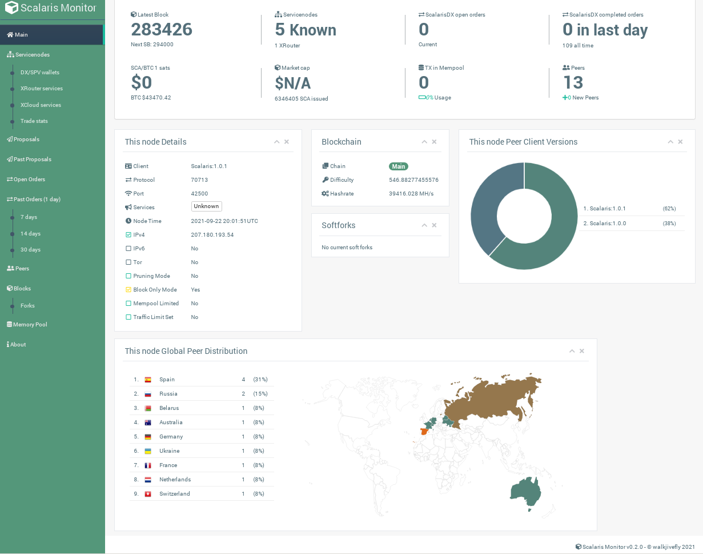

# Scalaris Monitor v0.1.1

Scalaris Monitor (SPM) is a visualisation and monitoring system for the Scalaris network.

## Features

* Extensive dashboard with general information about the node, connected peers and the blockchain
* Overview of servicenodes
* Overview of ScalarisDX open orders
* Overview of ScalarisDX recently completed orders
* Overview of active proposals in the Scalaris Decentralised Governance system
* Overview of past proposals in the Scalaris Decentralised Governance system
* Overview of all connected peers including country, ISP, client, traffic usage, supported services...
* Overview of the last received blocks
* Overview of recent orphaned blocks / alternative chains
* Overview of the memory pool and the inflight transactions

## Requirements

* Scalaris v1.0.0+
* Web server (e.g. Apache, PHP built-in web server)
* PHP 7.0.0+
*   php-cli php-common php-curl php-fpm php-json php-mbstring php-opcache php-readline php-sqlite3
* cURL
* SQLite3

## Installation

1. Download Scalaris Platorm Monitor either from [here](https://github.com/walkjivefly/scalaris-monitor/releases) or by cloning this  repository.
2. Edit `src/Config.php` to enter your scalarisd RPC credentials, set a password and change other settings.
3. Upload the folder to the public directory of your web server. If the folder is accesible via the internet, I recommend renaming the folder to something unique. Although Scalaris Monitor is password protected and access can be limited to a specific IP, there can be security flaws and bugs.
4. Open the URL to the folder in your browser and login with the password choosen in `src/Config.php`.
5. Optional: Run `chmod -R 770 /path-to-folder/{data, src, views}`. Only necessary for non Apache (`AllowOverride All` necessary) and publicly accessible web server. For more information, read the next section.

## Security
 
* Access to Scalaris Monitor is by default limited to localhost. This can be expanded to a specific IP or disabled. If disabled, make sure to protect the Scalaris Monitor folder (.htaccess, rename it to something unique 
that an attacker will not guess). An attacker could "guess" your password, since there is no build-in brute force protection (if IP protection is disabled).
* The `data` folder contains your rules, logs and geo information about your peers. Make sure to protect (e.g. `chmod -R 770 data`) this sensitive information if your web server is publicly accessible. The previously mentioned
IP protection doesn't work here. If you use `Apache` you are fine, since the folder is protected with `.htaccess` (make sure `AllowOverride All` is set in your `apache2.conf` file).

## Roadmap

- [ ] Loadsa brilliant stuff 

## Suggested enhancements for community participation

- [ ] Improve project structure
- [ ] Improve error handling
- [ ] More help icons
- [ ] Use popover for help
- [ ] Display expanded peer/block info (popup)
- [ ] More customization settings
- [ ] Sort mempool tx, request more

## Donate

If you find the Scalaris Monitor useful I'm happy to accept donations at 
[SWW9WwuwgvUANHwq26faVWUKHHNKzkgRep](https://explorer.scalaris.info/addr/SWW9WwuwgvUANHwq26faVWUKHHNKzkgRep)

